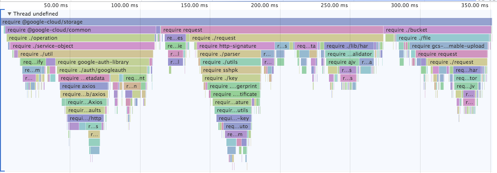

# require-so-slow

* Wondering why your applications is slow to start?
* `require` seems to take an eternity?
* Wonder no more!

This module produces a timeline of your `require`s and produces an output
that you can load in the Chrome [Timeline Viewer][].

[](https://chromedevtools.github.io/timeline-viewer/?loadTimelineFromURL=https://gist.githubusercontent.com/ofrobots/807e41c6931726710cf7187680a095a7/raw/2843049b37145316204bb6fd7766b4f0e0b58989/request.trace)

Click on the image above to go see an interactive version.

## Command Line Usage

```shell
# Profiles the timeline of requiring `request@latest` and generates a trace
# output file you can load in Chrome Timeline viewer [1]
$ npx require-so-slow request

# You can specify specific versions or dist-tags.
$ npx require-so-slow got@9.0.0
$ npx require-so-slow got@rc

# You can specify what output filename to use:
$ npm require-so-slow -o lodash.trace.json lodash
```


## API

```js
const requireSoSlow = require('require-so-slow');

// load stuff, run stuff.
require('request');

// Write a trace file at some point.
requireSoSlow.write('require-trace.trace');
```

[Timeline Viewer]: https://chromedevtools.github.io/timeline-viewer/
